# [UPDATED] Solar-Open-100B는 GLM-4.5-Air에서 파생되지 않았습니다.

이 레포지토리는 https://github.com/sionic-ai/solar-vs-glm (이하 원본 레포)의 주장이 옳지 않음을 보입니다.
저는 Solar-Open-100B, GLM-4.5-Air, 그리고 Phi-3.5-MoE-instruct 모델의 파라미터를 비교했고 Layernorm 파라미터의 cosine 유사도로는 모델간 유사성을 판단할 수 없음을 확인하였습니다.
그리고 Solar, GLM, Phi가 모두 동일한 쉐입을 갖는 `k_proj`와 `v_proj` 파라미터에서 역시 뚜렷한 패턴을 찾을 수 없었고, 이러한 내용을 정리하여 여러분께 공유하고자 합니다.

## 1. 동일 모델 내 레이어 간 Layernorm 파라미터의 cosine 유사도

원본 레포에서는 **(1)** 동일 모델의 서로 다른 레이어의 Layernorm 파라미터 사이에는 낮은 cosine 유사도가 관찰되지만,
**(2)** 서로 다른 모델의 동일 레이어의 Layernorm 파라미터 사이에는 높은 cosine 유사도가 관찰되기에 Solar가 GLM에서 파생되었다고 주장합니다.

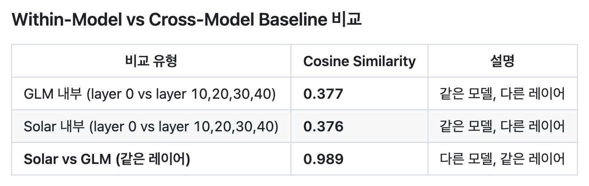

그래서 저는 먼저 **(1) 동일 모델의 서로 다른 레이어의 Layernorm 파라미터 사이의 cosine 유사도**를 계산해 보았습니다.
다음 이미지는 각각 Solar, GLM, Phi의 동일 모델 내에서 서로 다른 레이어 (10, 20, 30)의 Layernorm 파라미터간 cosine 유사도를 보여줍니다.
원본 레포의 주장과 달리 세 모델 모두 동일 모델 내에서 서로 다른 레이어의 Layernorm 파라미터 사이에는 0.99 수준의 매우 높은 cosine 유사도가 관찰됩니다.

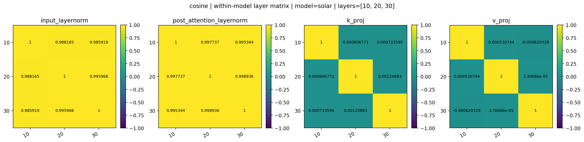

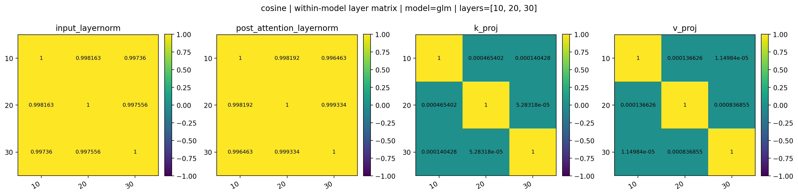


#### 논의1: 원본 레포의 주장과 달리 동일 모델 내의 서로 다른 레이어의 Layernorm 파라미터 사이에 높은 cosine 유사도가 관찰됩니다. 왜 일까요?

그렇다면 왜 원본 레포에서는 동일 모델내의 서로 다른 레이어 (10, 20, 30)의 Layernorm 파라미터 사이에 낮은 cosine 유사도가 관찰되었을까요?
그 이유는 동일 모델의 0번 레이어와 10, 20, 30, 40번째 레이어 사이의 cosine 유사도만을 비교했기 때문이라고 추정합니다.
다음은 원본 레포에서 동일 모델 내의 서로 다른 레이어 (0 vs 10, 20, 30, 40)의 Layernorm 파라미터간 cosine 유사도를 계산하는 코드입니다.

```python
# https://github.com/sionic-ai/solar-vs-glm/blob/56219dfba17b6ab78cf3cda8d53c270e87459edd/definitive_proof.py#L186-L207

for layer_j in [10, 20, 30, 40]:
    key_i = "model.layers.0.input_layernorm.weight"  # <-- 비교하는 레이어를 0번째로 고정함.
    key_j = f"model.layers.{layer_j}.input_layernorm.weight"

    try:
        glm_shard_i = glm_wm[key_i]
        glm_shard_j = glm_wm[key_j]

        glm_hdr_i = get_header(GLM, glm_shard_i)
        glm_hdr_j = get_header(GLM, glm_shard_j)

        raw_i = fetch_raw_bytes(glm_hdr_i["__url__"], glm_hdr_i, key_i, token)
        raw_j = fetch_raw_bytes(glm_hdr_j["__url__"], glm_hdr_j, key_j, token)

        arr_i = decode_bf16(raw_i)
        arr_j = decode_bf16(raw_j)

        cos = cosine(arr_i, arr_j)
        within_model_cosines.append(cos)
        print(f"  GLM[0] vs GLM[{layer_j}]: cos={cos:.6f}")
    except Exception as e:
        eprint(f"  [skip] {e}")
```

0번 레이어의 경우, 특히 `input_layernorm`은 다른 레이어의 normalization 파라미터와 비교했을 때 cosine 유사도가 낮을 가능성이 존재합니다.
그 이유는 이 파라미터가 **사실상 입력 임베딩 직후의 분포를 가장 직접적으로 받는 특수한 파라미터**이기 때문이라고 추정합니다.

즉, 0번 레이어의 `input_layernorm`은 학습 내내 입력단의 스케일/분산/토큰 빈도 편향 같은 저수준 통계를 강하게 흡수하는 경향이 있고, 
반대로 10/20/30/40 같은 중후반 레이어에서는 이미 여러 레이어를 거치며 정규화된 hidden state의 더 안정적인 분포를 상대합니다.
결과적으로 0번 레이어의 `input_layernorm` weight는 다른 레이어들과 역할이 달라질 수 있고, 그 차이가 0번 레이어 vs 나머지 레이어 비교에서 cosine 유사도 하락으로 나타날 수 있습니다.`

이러한 현상은 원본 레포에서 보고하지 않았던 전혀 다른 모델인 Qwen3-4B에서도 관찰할 수 있습니다.
0번 레이어와 15, 20번째 레이어는 0.8 정도의 cosine 유사도를 갖지만 10번 레이어와 15, 20번째 레이어는 0.97 수준의 매우 높은 cosine 유사도를 갖습니다.

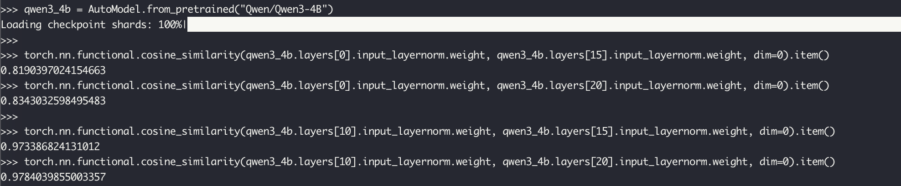

정리하면, 원본 레포의 관측은 "동일 모델 내 레이어 간 layer norm 파라미터의 cosine 유사도가 일반적으로 낮다"의 증거라기보다, 
"0번 레이어가 다른 레이어들과 성격이 달라서 0번 vs 나머지 비교에서 특히 낮게 나온다"는 특정 비교 설정의 산물로 해석하는 것이 더 타당합니다.

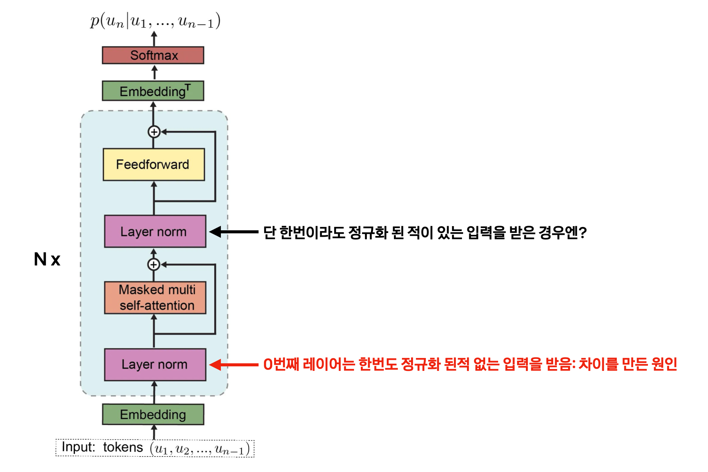

이때 한가지 궁금해지는 점이 있습니다. 0번째 레이어라고 하더라도 `input_layernorm`이 아닌, 한번이라도 정규화된 입력을 받는 `post_attention_layernorm` 파라미터라면 어떨까요?

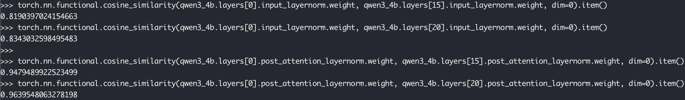

결과는 꽤 재밌습니다. 0번째 레이어의 `post_attention_layernorm` 파라미터는 15, 20번째 레이어의 `post_attention_layernorm` 파라미터와 0.94 이상의 매우 높은 cosine 유사도를 갖습니다.
이는 0번째 레이어라고 하더라도, 정규화된 입력을 받는 Layernorm 파라미터는 다른 레이어들과 높은 cosine 유사도를 가질 수 있음을 시사합니다.
논란이 되었던 Solar와 GLM, 그리고 Phi 모델에서도 이를 동일하게 확인할 수 있습니다. 

> 이를 모두 재현할 수 있는 깔끔한 파이썬 스크립트를 만들면 좋겠지만.. 엄청나게 큰 모델들을 계속 올렸다 내렸다 하는 것이 힘들어서 터미널에서 모델을 한번 불러와놓고 인터랙티브하게 진행했습니다.

- Solar-Open-100B
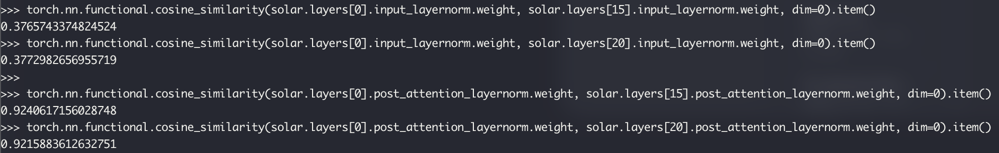

- GLM-4.5-Air
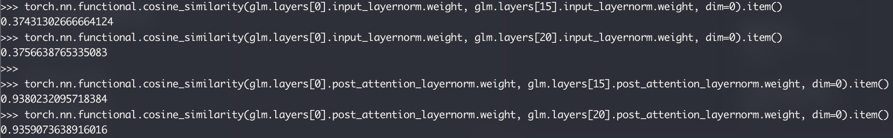

- Phi-3.5-MoE-instruct
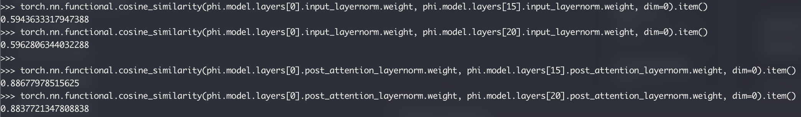

보시다시피 위의 모델에서도 0번째 레이어의 `input_layernorm` 파라미터는 원본 레포에서처럼 매우 낮은 수준의 cosine 유사도를 갖지만, 
`post_attention_layernorm` 파라미터는 10, 20, 30번째 레이어의 `post_attention_layernorm` 파라미터와 0.92 이상의 매우 높은 cosine 유사도를 갖습니다.

하지만 제가 이것을 확신있게 말하지 않고 '추정'한다고 한 것에는 이유가 있습니다.
실험 결과 **많은 모델들**이 이런 경향을 보이곤 하지만, 그렇다고 **모든 모델**이 그런 것은 아니였습니다. 
예를 들어 Qwen3-14B 등의 모델에서는 0번째 레이어의 `input_layernorm` 파라미터와 15, 20번째 레이어 사이에서도 0.9 이상의 높은 cosine 유사도가 관찰되곤 하며,
`post_attention_layernorm` 에서도 비슷한 수준의 높은 cosine 유사도가 관찰됩니다. 

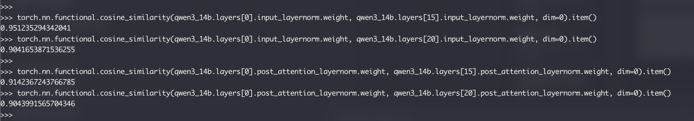

왜 대부분 모델들에서 0번째 레이어의 `input_layernorm` 파라미터가 다른 레이어들과도 높은 cosine 유사도를 갖는 반면,
어떤 모델은 그렇지 않은 것일까요? 이에 대해서는 아직 명확한 답을 찾지 못했습니다. 누군가 이에 대해 아시는 분이 있다면 알려주시면 감사하겠습니다.

## 2. 서로 다른 모델의 동일 레이어 간 Layernorm 파라미터의 cosine 유사도

그 다음으로 **서로 다른 모델의 동일 레이어의 Layernorm 파라미터 사이의 cosine 유사도**를 계산해 보았습니다.
다음 이미지는 각각 Solar vs GLM vs Phi의 동일 레이어 (10, 20, 30)의 Layernorm 파라미터간 cosine 유사도를 보여줍니다.

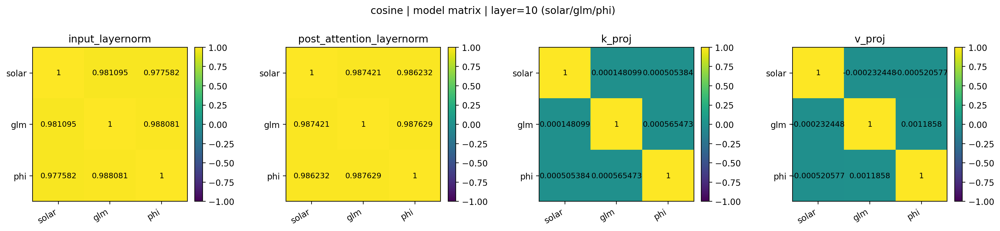


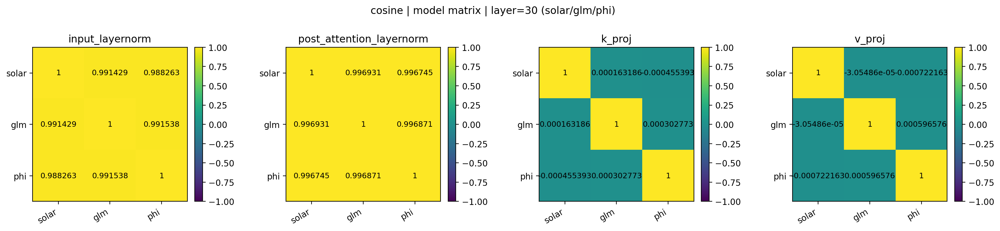

결과는 원본 레포의 주장과 일치합니다. 서로 다른 모델의 동일 레이어의 Layernorm 파라미터 사이에는 0.9 이상의 높은 cosine 유사도가 관찰됩니다.
그런데 흥미로운 것은 Phi 모델과 GLM 모델 사이의 cosine 유사도도 높다는 것입니다. 하지만 이것이 어떤 모델이 다른 모델에서 파생되었음을 의미할까요?
전 그렇지 않다고 생각합니다. 만약 이것이 Solar가 GLM에서 파생되었음을 의미한다면, 이것은 GLM 또한 Phi에서 파생되었음을 의미하게 됩니다.
하지만 저는 GLM이 Phi에서 파생된 모델이 아닐거라고 믿습니다.

#### 논의2: 그렇다면 왜 서로 다른 모델의 동일 레이어의 Layernorm 파라미터 사이에는 높은 cosine 유사도가 관찰되는걸까요?

그 이유는 Layernorm (RMSNorm)의 weight는 대부분 1.0으로 초기화되어 학습이 진행되더라도 낮은 분산을 갖는 경향 (즉, 1.0에서 크게 벗어나지 않고 대부분 양수로 유지되는 경향)을 갖기 때문이라고 추정합니다.
즉, 애초에 Layernorm 레이어가 생성될때부터 방향이 결정된 상태로 학습이 시작되고, 훈련이 진행되면서 그 방향이 크게 바뀌지 않는다는 것입니다.
이러한 파라미터에서는 스케일의 차이가 있더라도 원점으로부터 벡터의 방향만 보는 cosine 유사도가 높게 나올 가능성이 존재합니다.

이를 간단하게 확인 해볼 수 있는 미니 실험을 설계해봤습니다. 2개의 모델은 Layernorm 파라미터를 1.0로 초기화해서 훈련하고,
다른 2개의 모델은 Layernorm 파라미터를 랜덤으로 초기화하고 훈련한 후, 두 경우의 동일 레이어의 Layernorm 파라미터간 cosine 유사도를 계산하는 것입니다.
물론 초거대 언어모델 훈련과는 그 스케일을 비교할 수 없지만, 작은 모델로도 충분히 이 현상을 관찰할 수 있었습니다.

```python
python3 train_gpt2.py
```

```text
First step losses: [5.69, 5.668, 5.656, 5.702]

Last step losses: [0.016, 0.005, 0.008, 0.005]

Cosines (ones init): {'ln_1': [0.99989, 0.99997, 0.99996, 0.99996, 0.99994, 0.99994, 0.99993, 0.99993, 0.99992, 0.99991, 0.99989, 0.99989], 'ln_2': [0.99988, 0.99994, 0.99995, 0.99995, 0.99994, 0.99993, 0.99991, 0.9999, 0.99988, 0.99985, 0.99981, 0.99981]}

Cosines (rand init): {'ln_1': [0.00838, 0.01129, -0.03427, -0.04055, -0.01131, 0.01684, -0.00854, -0.00561, -0.08937, -0.00496, -0.05543, -0.03044], 'ln_2': [0.02545, 0.04847, -0.06951, 0.06371, -0.01576, 0.05861, 0.05178, -0.03114, 0.11864, 0.02044, -0.05061, -0.12613]}
```

`train_gpt2.py`에서는 작은 GPT2 모델 4개를 각각 다른 시드로 랜덤 초기화 (Fine-tuning 아님) 하였고 모델마다 서로 다른 등차수열로 구성된 입력 토큰 (각 모델의 데이터셋이 달랐음을 가정)에 대한 next prediction token을 예측하도록 훈련해봤습니다.
간단한 문제이기 때문에 4개의 모델 모두 문제를 거의 완벽하게 맞출 수 있을 정도로 잘 수렴했으며, 훈련이 끝난 후 Layernorm 파라미터간 cosine 유사도를 계산했습니다.

위의 실험 결과에서 볼 수 있듯이, Layernorm 파라미터를 1.0로 초기화한 경우에는 서로 다른 모델의 동일 레이어의 Layernorm 파라미터간 cosine 유사도가 0.999 수준으로 매우 높게 나오지만,
Layernorm 파라미터를 랜덤으로 초기화한 경우에는 서로 다른 모델의 동일 레이어의 Layernorm 파라미터간 cosine 유사도가 거의 0에 가까운 값을 갖습니다.
Layernorm 파라미터의 cosine 유사도는 학습 결과가 비슷해서가 아니라 **초기화에서 이미 결정된 방향성이 끝까지 남아있어서** 이렇게 극단적으로 갈렸습니다. 

조금 더 구체적으로 말하면, ones init의 경우 Layernorm weight 벡터는 시작부터 모든 원소가 양수이면서 거의 같은 값(1.0)으로 정렬되어 있습니다. 
학습이 진행되면서 일부 원소들이 조금씩 커지거나 작아지더라도, 벡터 전체의 방향은 여전히 거의 (1,1,1,…) 방향에 붙어있는 상태로 유지되기 쉽습니다. 
따라서 서로 다른 두 모델이 완전히 다른 seed와 데이터로 학습되더라도 Layernorm weight 벡터는 비슷한 방향을 유지하며, 그 결과 cosine 유사도가 0.999 수준으로 높게 나오는 것입니다.

반대로 rand init의 경우에는 Layernorm weight의 각 원소가 양수/음수로 섞인 상태에서 시작합니다.
이때 두 모델의 Layernorm weight는 **애초에 시작부터 서로 다른 방향을 갖게 됩니다.**
학습이 진행되며 손실을 줄이기 위해 weight 값이 변화하더라도 Layernorm weight는 MLP나 Attention weight처럼 태스크를 
직접적으로 표현하기 위해 크게 재배열되는 파라미터가 아니기 때문에(대개는 스케일을 조정하는 보조 파라미터 역할), 이 초기 방향성이 충분히 오래 보존됩니다. 
그 결과 두 모델 사이의 cosine 유사도는 0 근처에 머무르게 됩니다.

즉, 이 실험은 다음을 보여줍니다.
- Layernorm weight의 cosine 유사도는 모델이 같은 데이터로 학습되었는지, 또는 서로 파생되었는지에 대한 신뢰할 만한 증거가 아니다.
- Layernorm weight가 어떤 공통 prior (1.0 초기화 등) 아래에서 시작했는지를 강하게 반영하는 지표일 가능성이 크다.

따라서 서로 다른 모델의 동일 레이어에서 Layernorm 파라미터 cosine 유사도가 높다는 관측만으로는,
그 모델들이 구조적으로/학습적으로 가까운 관계(예: 파생 관계)에 있다고 결론내리기 어렵습니다. 
특히 Layernorm처럼 파라미터 수가 작고, 값의 분포가 제한적으로 유지되는 경향이 있는 파라미터에서는 cosine 유사도가 매우 쉽게 false positive를 만들 수 있기도 하구요.

#### 논의3: 그렇다면 cosine 유사도는 모델간 파라미터 유사성을 판단하는데 적절한 지표일까요?

제 대답은 'No'입니다. cosine 유사도는 벡터의 크기를 무시하고 원점으로부터의 방향만 보기 때문에, Layernorm(RMSNorm)처럼 값의 분포가 매우 균질하고 대부분 양수로 유지되는 이러한 파라미터에서는 서로 전혀 다른 모델이라도 쉽게 높은 값이 나올 수 있습니다.
이런 특성 때문에 Layernorm 파라미터의 cosine 유사도를 근거로 모델 간 파생 관계를 주장하는 것은 위험합니다. 이를 보완하기 위해, 평균(오프셋) 영향을 제거한 centered cosine 유사도를 함께 확인해봤습니다.

## 3. centered cosine 유사도

centered cosine 유사도는 각 벡터에서 평균을 뺀 뒤 cosine 유사도를 계산합니다. 즉, 단순히 전체 스케일이나 공통 오프셋(예: 모든 원소가 1 근처라는 성질)에 의해 방향이 비슷해 보이는 효과를 줄이고, 
"평균으로부터의 상대적 패턴"이 얼마나 비슷한지를 보게 됩니다.

```python
def centered_cosine_sim(a: torch.Tensor, b: torch.Tensor, eps: float = 1e-12) -> float:
    a = a - a.mean()
    b = b - b.mean()
    na = a.norm().clamp_min(eps)
    nb = b.norm().clamp_min(eps)
    return (a @ b / (na * nb)).item()
```

직관적으로는, 두 파라미터 벡터가 모두 1.0 근처에 몰려 있어도(그래서 일반 cosine이 높게 나와도), "어느 차원이 평균보다 조금 더 큰지/작은지" 같은 미세한 패턴이 다르면 centered cosine은 낮게 나옵니다. 
반대로 평균을 제거한 뒤에도 여전히 높은 유사도가 유지된다면, 그때는 파라미터 구조가 실제로 비슷할 가능성이 커집니다.

다음 이미지는 Solar vs GLM vs Phi의 동일 레이어(10, 20, 30)에서 Layernorm 파라미터의 centered cosine 유사도를 보여줍니다.


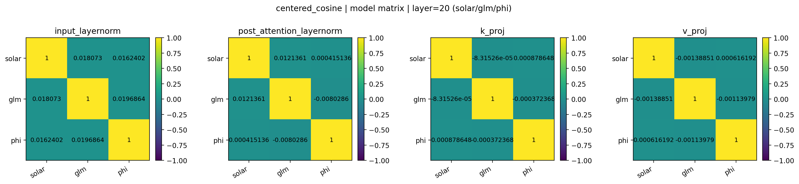


결과는 명확합니다. 일반 cosine에서는 0.9 이상으로 매우 높았던 반면, centered cosine에서는 서로 다른 모델 간 동일 레이어의 Layernorm 파라미터 유사도가 대부분 0에 가까운 값으로 떨어집니다. 이는 일반 cosine 유사도가 높게 나온 이유가 모델이 실제로 비슷해서라기보다, 
Layernorm 파라미터가 공통적으로 1 근처의 좁은 분포를 갖는다는 성질(강한 prior/낮은 분산) 때문이었음을 강하게 시사합니다.
따라서 Layernorm 파라미터의 cosine 유사도만으로 모델 간 유사성(특히 파생 관계)을 주장하는 것은 설득력이 약하며, 최소한 centered cosine처럼 평균 효과를 제거한 지표로도 유사성이 유지되는지 함께 확인해야 합니다.

한편, 동일한 모델 내에서 서로 다른 레이어 간 Layernorm 파라미터의 centered cosine 유사도는 어떨까요?


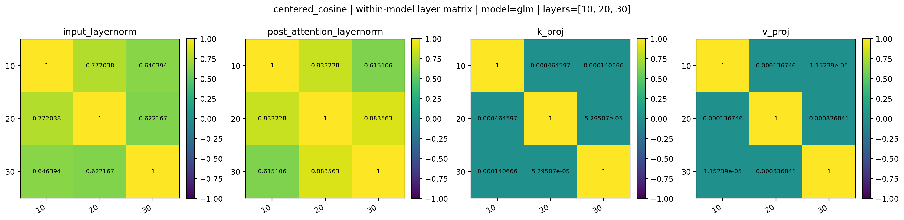
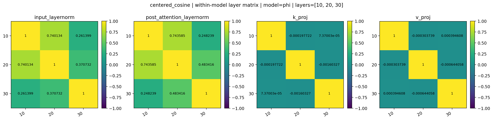

세 모델 모두 동일 모델 내에서 서로 다른 레이어 (10, 20, 30)의 Layernorm 파라미터간 centered cosine 유사도는 꽤나 높은 값을 갖습니다.
이전에 보여드린 cosine 유사도처럼 0.99 수준의 높은 값은 아니지만, 타 모델과의 centered cosine 유사도가 0 근처로 떨어지는 것을 생각하면 이는 상당히 높은 값입니다.
이를 통해 동일 모델 내에서는 서로 다른 레이어의 Layernorm 파라미터가 평균을 제거한 뒤에도 어느 정도 유사한 패턴을 갖는다는 점을 알 수 있습니다.
또한 세 모델 모두 더 가까운 레이어의 Layernorm 파라미터끼리 더 높은 centered cosine 유사도를 갖는 경향이 관찰됩니다.

#### 논의 4: centered cosine은 '완벽한' 지표일까요?
centered cosine은 평균(오프셋) 효과를 제거해 주기 때문에 단순 cosine보다 더 informative한 경우가 많습니다. 
다만 이 지표도 완벽하지는 않습니다. 예를 들어 (1) 벡터의 분산이 매우 작아 평균을 뺀 뒤 노름이 작아지면 수치적으로 불안정해질 수 있고, (2) 단순히 상대적 패턴(증감 방향)만 보므로 절대적인 스케일 차이나 tail의 크기 차이는 놓칠 수 있습니다. 
그래서 centered cosine 외에도 절대 차이(mean_abs_diff, p99_abs_diff) 및 상대 거리(rel_l2) 같은 지표를 함께 확인했습니다.

## 4. 기타 지표들

### 1) Pearson 상관계수
Pearson 상관계수는 centered cosine과 같은 종류의 지표로, 
둘 다 "평균을 제거한 뒤의 패턴 유사성"을 측정하고 결과적으로는 평균 제거 후 방향성이 얼마나 일치하는지를 본다는 점에서 해석이 아주 크게는 다르지 않습니다.

다음 이미지는 Solar vs GLM vs Phi의 동일 레이어(10, 20, 30)에서 Layernorm 파라미터의 Pearson 상관계수를 보여줍니다.

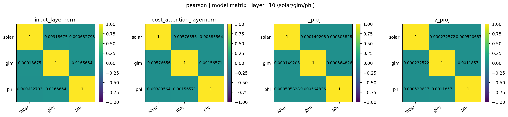


그리고 다음 이미지는 동일 모델 내에서 서로 다른 레이어 간 Layernorm 파라미터의 Pearson 상관계수를 보여줍니다.

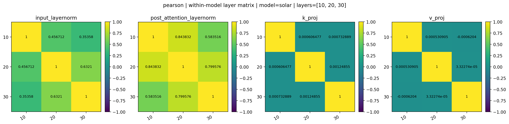


앞서 설명한 것 처럼 Pearson 상관계수 결과는 centered cosine 유사도와 매우 유사한 양상을 보입니다.

### 2) `mean_abs_diff`: 절대 평균 차이 (Abs L1 distance)

`mean_abs_diff`는 두 벡터의 원소별 차이의 절대값을 평균낸 값입니다.
- 값이 작을수록 두 파라미터가 원소 단위로 가깝다는 뜻입니다.
- cosine처럼 방향만 보지 않고, 실제 값의 차이를 직접 측정합니다.
- Layernorm처럼 값이 1 근처에 몰려 있어도, '얼마나 1에서 벗어났는지'가 모델마다 다르면 이 지표가 차이를 잡아낼 수 있습니다.

다음은 Solar vs GLM vs Phi의 동일 레이어(10, 20, 30)에서 Layernorm 파라미터의 `mean_abs_diff`를 보여줍니다.

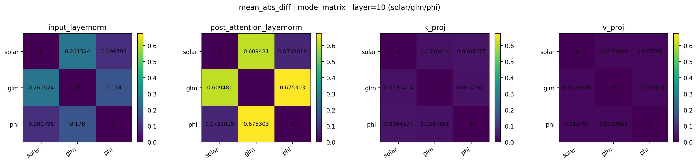
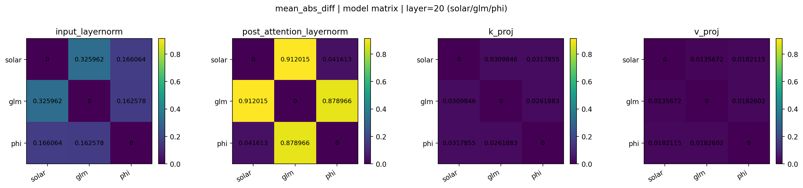
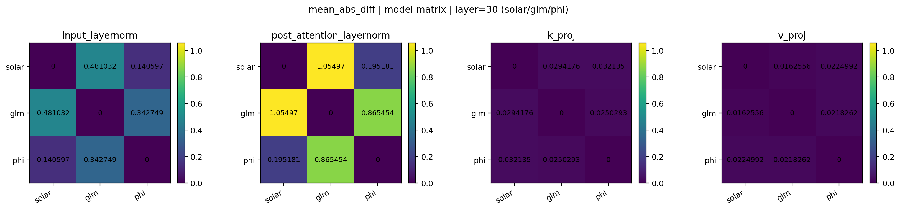

결과를 보면 Layernorm 파라미터에서 Solar vs GLM보다 오히려 Phi vs GLM의 `mean_abs_diff`가 더 작게 측정되고 있습니다.
만약 Solar가 GLM에서 파생되었다면, Solar vs GLM의 `mean_abs_diff`가 더 작게 나올 법도 한데 그러지는 않았습니다.

한편, `k_proj`와 `v_proj`에서는 `mean_abs_diff`가 절대값의 기준에서는 상당히 작아 보일 수도 있는데
이에 대해서는 `4) rel_l2`에서 더 다루겠습니다.

그리고 다음은 동일 모델 내에서 서로 다른 레이어 간 Layernorm 파라미터의 `mean_abs_diff`를 보여줍니다.
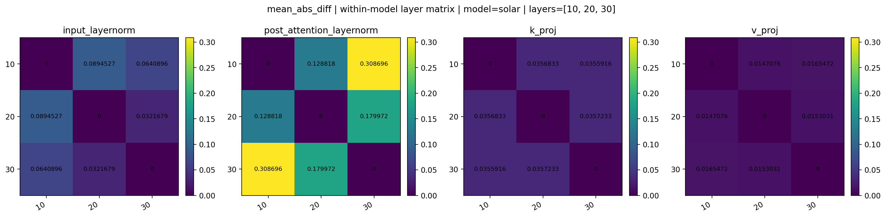
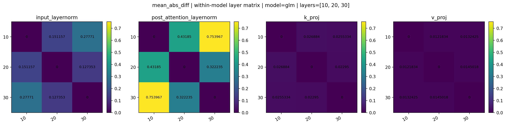
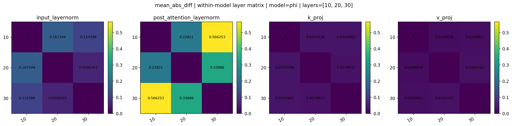

다만 `mean_abs_diff`는 전체 평균 차이를 요약한 값이라, 
소수 차원에서만 크게 벌어지는 tail 차이를 별도로 강조해 보여주진 못할 수 있습니다. 
따라서 `p99_abs_diff` 같은 tail 전용 지표도 함께 살펴봅니다.

### 3) `p99_abs_diff`: `|w|` 분포의 99퍼센타일 차이

`p99_abs_diff`는 각 벡터의 절대값 분포에서 99퍼센타일의 차이를 비교하는 지표입니다. (구현에서는 각 모델의 `|w|`에 대한 p99를 각각 구한 뒤, 그 차이를 계산합니다.)
이 지표는 평균(mean)보다 극단값/꼬리(tail)에 민감합니다. Layernorm weight는 대부분의 차원에서 비슷한 값을 갖더라도, 일부 차원에서만 유독 크게 튀는 값이 나타나는 경우가 종종 있는데, 이런 꼬리 스케일의 차이를 더 잘 드러낼 수 있습니다. 
특히 파생/복제 관계라면 중앙값 근처뿐 아니라 tail 분포까지 유사할 가능성이 높기 때문에, p99 수준 비교는 의외로 유용한 보조 근거가 됩니다.  

다만 주의할 점도 있습니다. 이 지표는 어느 차원이 튀는지(좌표의 정렬/대응)를 직접 비교하는 것이 아니라, 각 벡터의 `|w|` 분포에서 tail의 크기만 비교합니다.
즉, 값이 비슷하다는 것은 tail의 스케일이 비슷하다는 의미이지, 원소별로 동일하다는 뜻은 아닙니다.

다음은 Solar vs GLM vs Phi의 동일 레이어(10, 20, 30)에서 Layernorm 파라미터의 `p99_abs_diff`를 보여줍니다.

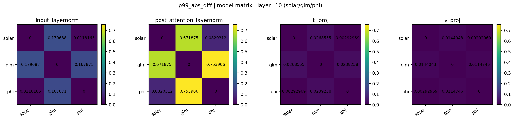
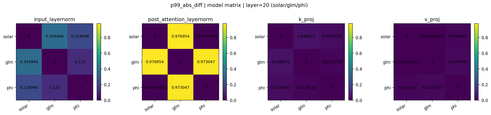
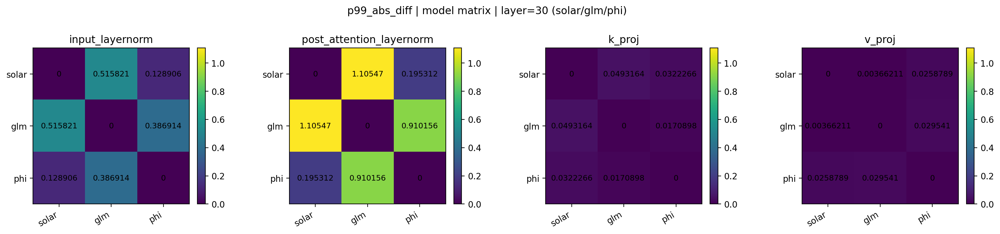

결과를 보면, 많은 경우에서 Solar vs GLM보다 Phi vs GLM의 `p99_abs_diff`가 더 작게 측정됩니다. 
이는 tail 스케일 차이라는 관점에서도 Solar가 Phi에 비해 GLM에 특별히 더 가깝다고 보기 어렵다는 점을 시사합니다. 
오히려 일부 파라미터에서는 Solar가 Phi와 상당히 유사한 tail 스케일을 보이는 경향도 관찰됩니다. (다시 한번 말하지만 tail값의 스케일이 비슷하다는 뜻이지, 원소별로 동일하다는 뜻은 아닙니다)

다음은 동일 모델 내에서 서로 다른 레이어 간 Layernorm 파라미터의 `p99_abs_diff`를 보여줍니다.

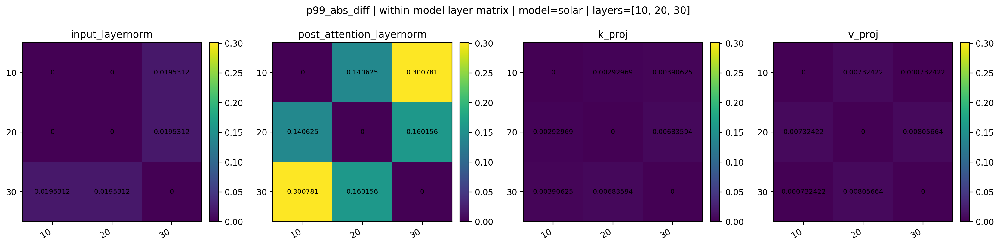
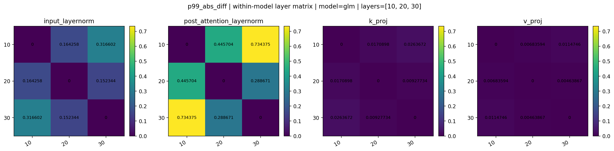
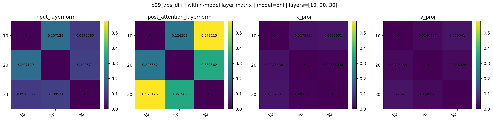

한편 `p99_abs_diff` 역시 절대값 기반 지표이므로, Layernorm weight 자체의 전체 스케일이 약간만 달라도 값이 커질 수 있습니다. 
따라서 절대 차이만으로 해석이 흔들릴 수 있는 상황을 보완하기 위해, 스케일을 정규화한 상대 거리 지표도 함께 확인해볼 필요가 있습니다.

### 4) `rel_l2`: 상대 거리 (Relative L2 distance)

`rel_l2`는 두 벡터의 L2 차이를 기준 벡터의 L2 노름으로 정규화한 값으로, 대략 다음 형태로 이해할 수 있습니다.

- `rel_l2(a, b) = ||a - b||_2 / ||a||_2`

절대 차이 기반 지표들은 (예: `mean_abs_diff`, `p99_abs_diff`) 파라미터의 전체 스케일이 커지면 자동으로 값이 커지는 경향이 있습니다. 반면 `rel_l2`는 기준 벡터의 크기로 나누어 상대화하기 때문에, Layernorm weight의 전체 스케일이 약간 다른 상황에서도 비교가 더 공정해질 수 있습니다. (단, 기준을 `a`로 두기 때문에 구현에 따라 비대칭일 수 있으며, 어떤 모델을 분모로 잡는지에 따라 수치가 달라질 수 있습니다.)

다음은 Solar vs GLM vs Phi의 동일 레이어(10, 20, 30)에서 Layernorm 파라미터의 `rel_l2`를 보여줍니다.

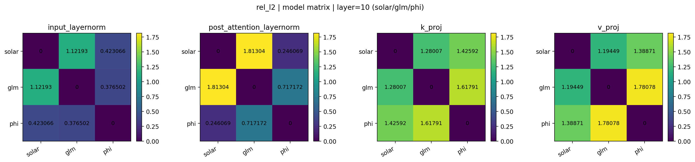
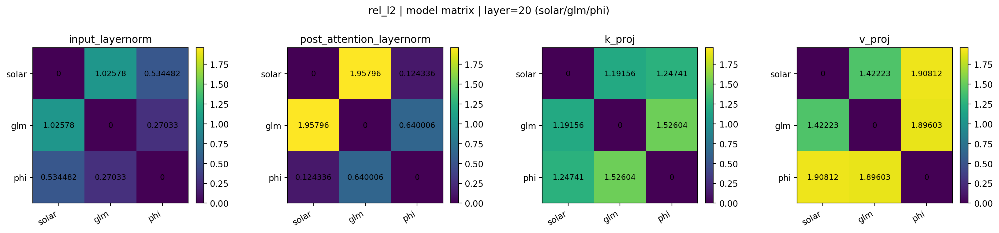
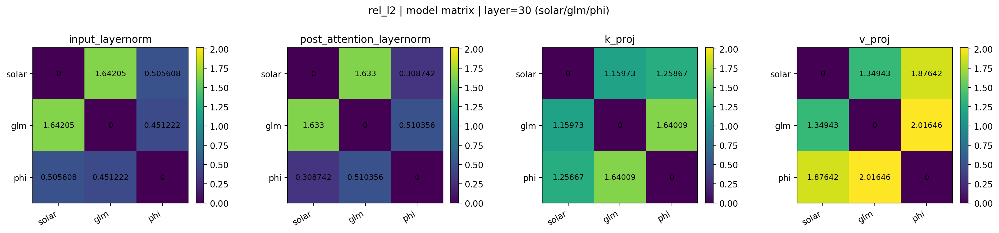

예를 들어 20번째 레이어의 `post_attention_layernorm`을 보면, Solar vs GLM의 `rel_l2`가 1.96으로 가장 크기 때문에 두 파라미터가 상대적으로 매우 멀다는 것을 알 수 있습니다. 
Phi vs GLM은 0.64로 Solar vs GLM보다는 가깝지만, 여전히 작다고 보기 어려운 값입니다. 
한편 Solar vs Phi는 0.12로 비교적 작은 값을 보이지만, 다른 절대 차이 지표(예: `mean_abs_diff` 등)에서의 값(0.04, 0.07 등)과 의미 있는 차이가 함께 관찰되었다는 점을 고려하면,
abs diff 관점에서 비교적 차이가 작았던 Solar vs Phi도 스케일 관점에서는 꽤 먼 거리를 가지고 있다는 점을 알 수 있습니다.

또한 스케일을 상대화해서 비교해보니  **`k_proj`, `v_proj`에서도 큰 차이가 생겼는데 각 모델끼리 상당히 먼 거리를 보이고 있습니다.**
이는 이 파라미터들이 절대 차이 관점에서는 모두 비슷하게 작게 나왔던 것과 대조적으로, Solar, GLM, Phi가 서로 상당히 다른 스케일을 갖고 있음을 시사합니다.

다음은 동일 모델 내에서 서로 다른 레이어 간 Layernorm 파라미터의 `rel_l2`를 보여줍니다.

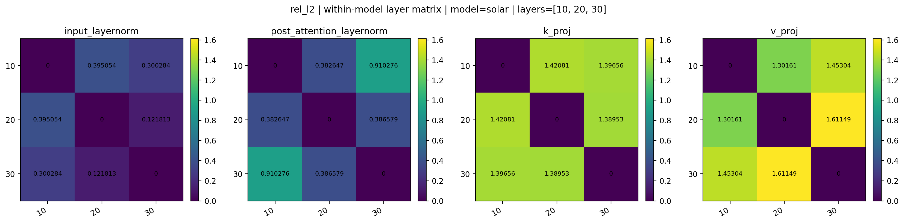
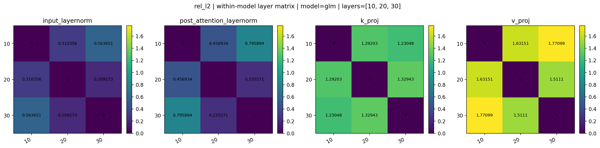
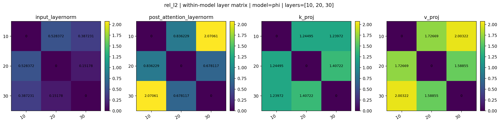

정리하면, `p99_abs_diff`와 `rel_l2` 모두에서 Solar가 GLM에 특별히 더 가깝다는 일관된 패턴은 확인하기 어렵습니다. 
오히려 특정 파라미터에서는 Solar가 Phi와 더 비슷한 스케일/거리를 보이는 경우도 관찰되며, 
이는 Layernorm 파라미터의 cosine 유사도 비교만으로 파생 관계를 주장하기가 어렵다는 결론을 한층 강화합니다.

### 5) `cv_diff`: 변동계수(CV) 차이

`cv_diff`는 두 벡터의 변동계수(Coefficient of Variation, CV)의 차이를 비교하는 지표입니다. 
변동계수는 평균 대비 표준편차의 크기를 나타내는 값으로, 다음과 같이 정의할 수 있습니다.

- `CV(x) = std(x) / |mean(x)|`
- `cv_diff(a, b) = |CV(a) - CV(b)|`

Layernorm(RMSNorm) weight는 보통 평균이 1에서 별로 멀지 않고(대부분 양수), 분산도 비교적 작은 편입니다. 
이런 파라미터를 비교할 때 단순히 `std`만 보면 둘 다 작다 수준에서 차이가 잘 드러나지 않을 수 있는데, 
`CV`는 이를 평균으로 나눠 **평균 대비 얼마나 흔들리는지(상대적 산포)** 를 보기 때문에 얼마나 1 근처로 균질하게 붙어있는가를 더 직접적으로 비교할 수 있습니다.  

즉 `cv_diff`는 두 모델의 Layernorm weight가 값의 패턴이 비슷한지(코사인 계열)와는 별개로, 
**분포의 안정성/산포 수준 자체가 얼마나 비슷한지**를 확인하는 데 유용합니다.

다음은 Solar vs GLM vs Phi의 동일 레이어(10, 20, 30)에서 Layernorm 파라미터의 `cv_diff`를 보여줍니다.

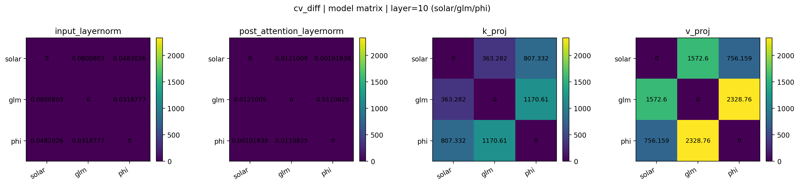
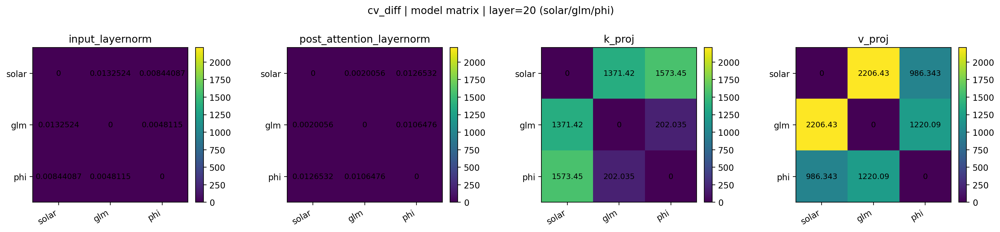
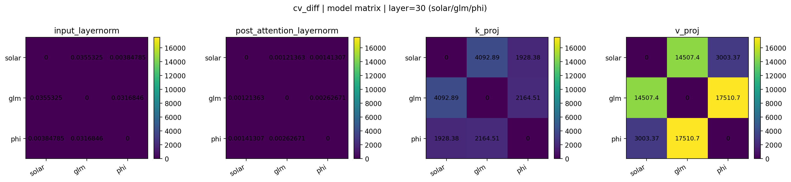

다만 이번 비교에서는 **세 모델 쌍의 Layernorm `cv_diff`가 거의 0으로 측정**되었습니다. 
이는 세 모델의 Layernorm weight가 평균 대비 표준편차 비율(CV) 측면에서 매우 유사하다는 뜻입니다. 

즉 `cv_diff`가 0에 가깝다는 것은, 적어도 평균 대비 표준편차 비율(CV) 관점에서 
세 모델의 Layernorm weight 분포가 매우 유사하다는 의미로 해석할 수 있으며,
이는 Layernorm 파라미터가 모델이 달라도 비슷한 통계적 형태를 띠기 쉽다는 점을 시사합니다.

## 5. 결론
이 레포지토리에서는 Solar-Open-100B, GLM-4.5-Air, Phi-3.5-MoE-instruct의 파라미터를 여러 지표로 비교하여, 원본 레포가 제시한 Layernorm cosine 유사도 기반 주장만으로는 모델 파생 관계를 결론내리기 어렵다는 점을 보였습니다.

핵심 요약은 다음과 같습니다.
- 동일 모델 내에서도 Layernorm weight는 레이어 간 cosine 유사도가 매우 높게 나올 수 있으며, 특히 원본 레포처럼 0번 레이어의 `input_layernorm`만 기준으로 잡아 비교하면 특수한 설정 때문에 낮게 관측될 수 있습니다. 저는 이를 상당히 다양한 모델로 확인했으며, 같은 0번 레이어라고 해도 정규화된 입력을 받는 `post_attention_layernorm`와 그렇지 않은 `input_layernorm`은 서로 다른 특성을 보이기도 한다는 점도 확인했습니다.
- 서로 다른 모델 간 동일 레이어의 Layernorm weight에서 cosine 유사도가 높게 나오는 현상은, Layernorm/RMSNorm scale 파라미터가 1에서 초기화 되고 낮은 분산, 양수 편향등을 갖는 성질 때문에 쉽게 발생할 수 있습니다. 즉, 높은 cosine은 파생 관계의 강한 증거가 아니라 공통 prior를 반영하는 false positive가 될 수 있습니다. 또한 이를 gpt2 toy 실험으로 어느정도 뒷받침 했습니다.
- 평균의 영향을 제거한 centered cosine(및 Pearson 상관계수)에서는 서로 다른 모델 간 Layernorm 유사도가 대부분 0 근처로 떨어졌습니다. 이는 일반 cosine에서 관찰된 높은 유사도가 실제 좌표 패턴의 일치라기보다 평균/오프셋 성질에 크게 의존했음을 시사합니다.
- 차이 기반 지표(mean_abs_diff, p99_abs_diff)와 상대 거리(rel_l2)에서도 Solar가 GLM에 일관되게 더 가깝다는 패턴은 확인되지 않았습니다. 경우에 따라서는 Phi가 GLM에 더 가깝게 측정되기도 했습니다.
- `k_proj`, `v_proj`처럼 쉐입이 동일한 큰 행렬 파라미터에서도, 모델 쌍 간에 파생 관계를 뒷받침할 만한 뚜렷하고 일관된 패턴은 관찰되지 않았습니다.

결론적으로, Layernorm weight의 cosine 유사도 하나만으로 모델 파생 관계를 주장하는 것은 설득력이 약하며, 최소한 centered cosine(또는 Pearson), 절대/상대 거리 지표까지 함께 보더라도 Solar가 GLM에서 파생되었다고 볼 만한 일관된 근거는 확인되지 않았습니다.

## 6. 재현 방법
각종 통계값을 추출하기 위해서는 다음 코드를 실행하면 됩니다.

```bash
python3 main.py
```

