# Solar-Open-100B는 GLM-4.5-Air에서 파생되지 않았습니다.
이 레포지토리는 https://github.com/sionic-ai/solar-vs-glm 의 주장이 잘못되었음을 보입니다.
Solar-Open-100B, GLM-4.5-Air, 그리고 Phi-3.5-MoE-instruct 모델의 Layernorm 파라미터를 비교하여 Layernorm 파라미터의 Cosine 유사도로는 모델간 유사성을 판단할 수 없음을 보여줍니다.

## 1. 모델간 동일 레이어에서의 Layernorm 파라미터 비교

### 10번째 레이어에서의 Layernorm Cosine 유사도 비교

세 모델의 10번째 레이어에서의 Layernorm 파라미터를 비교한 결과, 모두 0.9 이상의 높은 Cosine 유사도를 보입니다.
만약 Solar-Open-100B가 GLM-4.5-Air에서 파생된 모델이라면, GLM-4.5-Air 역시 Phi-3.5-MoE-instruct에서 파생된 모델이어야 합니다.

### 20번째, 30번째 레이어에서의 Layernorm Cosine 유사도 비교
20번째와 30번째 레이어에서도 동일한 현상이 관찰됩니다.

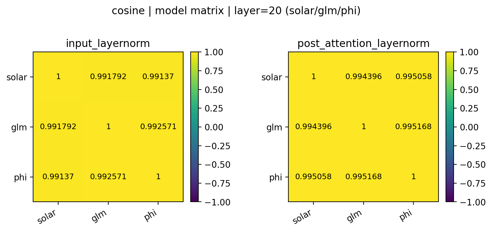

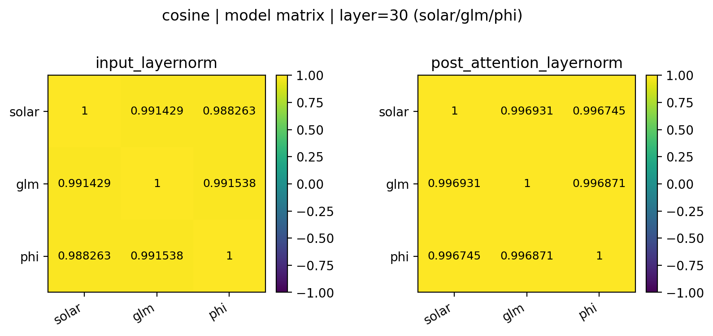

### 10번째 레이어에서의 Layernorm Mean Abs Diff 비교

이번엔 Cosine 유사도가 아니라 Mean Abs Diff로 비교합니다. 
`input_layernorm`을 기준으로 볼 때, Solar-Open-100B와 GLM-4.5-Air의 Mean Abs Diff는 0.2615로, GLM-4.5-Air와 Phi-3.5-MoE-instruct의 Mean Abs Diff 0.1783보다 더 큽니다.
만약 이 정도 차이로 Solar-Open-100B가 GLM-4.5-Air에서 파생된 모델이라고 주장한다면, GLM-4.5-Air 역시 Phi-3.5-MoE-instruct에서 파생된 모델이라고 주장해야 할 것입니다.

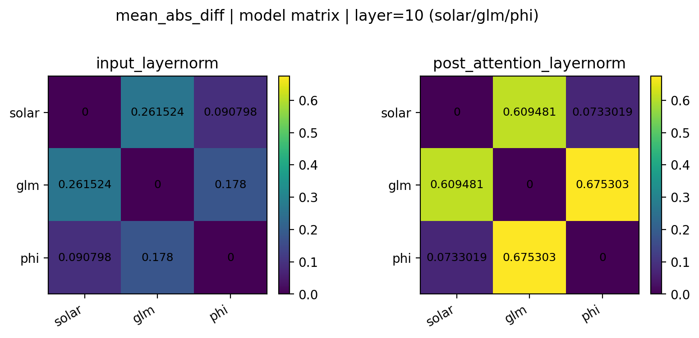

### 20번째, 30번째 레이어에서의 Layernorm Mean Abs Diff 비교

20번째와 30번째 레이어에서도 동일한 현상이 관찰됩니다.

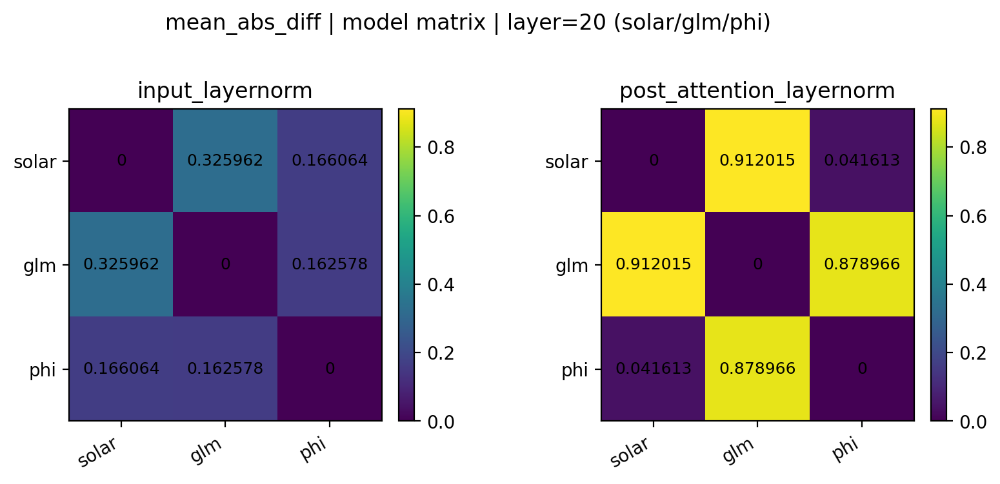

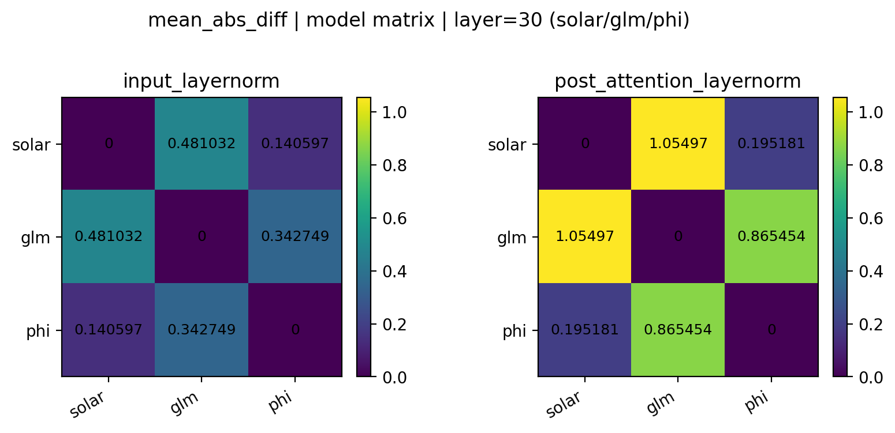

## Element-wise 값 비교

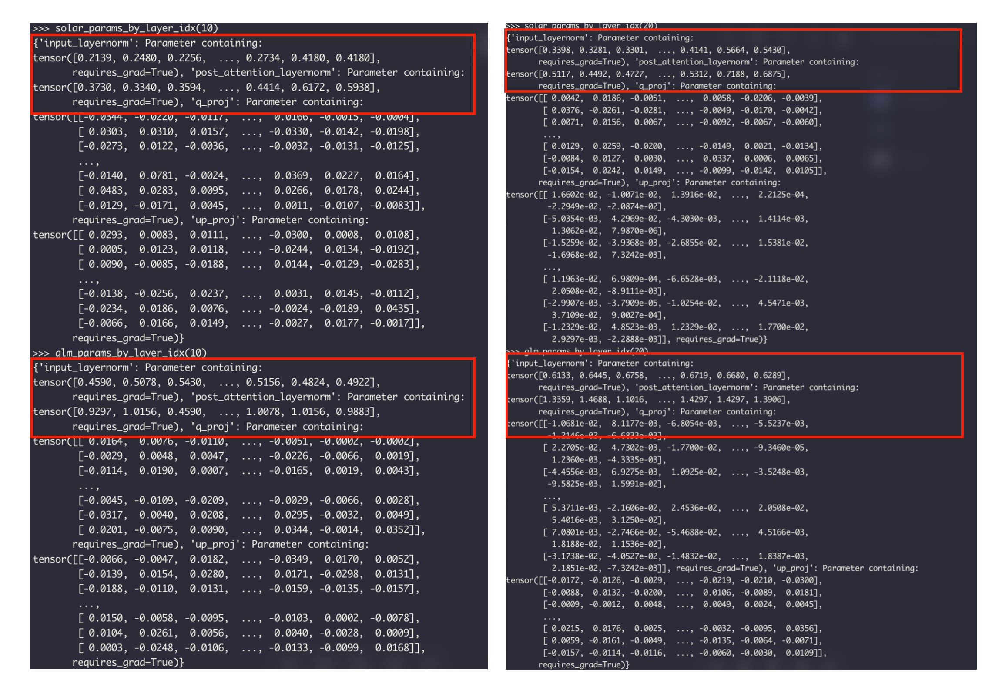

Element-wise로 값을 비교해보면 Solar-Open-100B와 GLM-4.5-Air의 Layernorm 파라미터가 상당히 다르다는 것을 알 수 있습니다.

## 2. 모델간 다른 레이어에서의 Layernorm 파라미터 비교

이번엔 모델간 다른 레이어에서의 Layernorm 파라미터를 비교합니다.
Solar-Open-100B의 10번째 레이어, GLM-4.5-Air의 20번째 레이어, Phi-3.5-MoE-instruct의 30번째 레이어에서의 Layernorm 파라미터를 비교합니다.

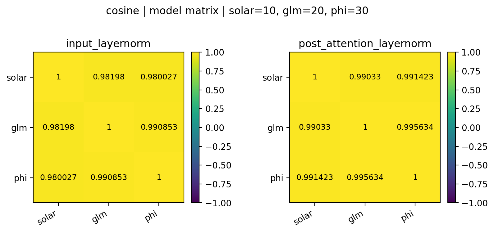

https://github.com/sionic-ai/solar-vs-glm 에서는 이 차이가 굉장히 작다고 주장하였으나 이는 사실이 아닙니다.
서로 다른 레이어에서 추출한 Layernorm 파라미터 간의 Cosine 유사도 역시 0.9 이상으로 매우 높습니다.

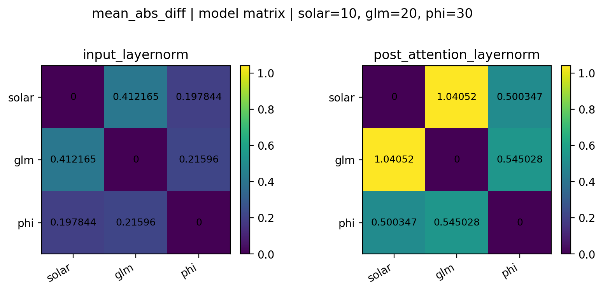

마찬가지로 Mean Abs Diff 역시 차이가 존재하며 Solar와 GLM 모델간의 차이가 GLM과 Phi 모델간의 차이보다 더 큽니다.
`input_layernorm`을 기준으로 볼 때, Solar-Open-100B와 GLM-4.5-Air의 Mean Abs Diff는 0.4121로 , GLM-4.5-Air와 Phi-3.5-MoE-instruct의 Mean Abs Diff 0.2159보다 더 큽니다.
따라서 서로 다른 레이어에서 추출한 Layernorm 파라미터 간의 비교 역시 모델간 유사성을 판단하는데 적절하지 않음을 알 수 있습니다.

## 3. 같은 모델에서 서로 다른 레이어의 Layernorm 파라미터 비교

마지막으로 같은 모델에서 서로 다른 레이어의 Layernorm 파라미터를 비교합니다.
https://github.com/sionic-ai/solar-vs-glm 에서는 서로 다른 레이어에서 추출한 Layernorm 파라미터 간의 Cosine 유사도가 0.3 ~ 0.4 정도로 낮다고 주장하였으나 이는 사실이 아닙니다.

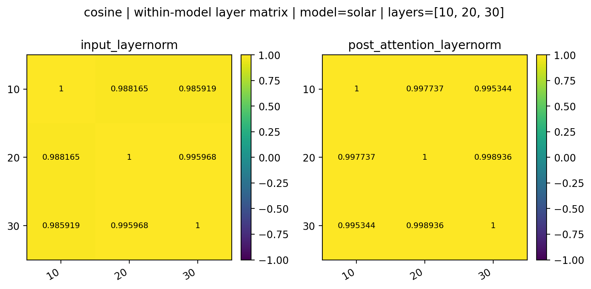

다른 모델들도 마찬가지입니다.

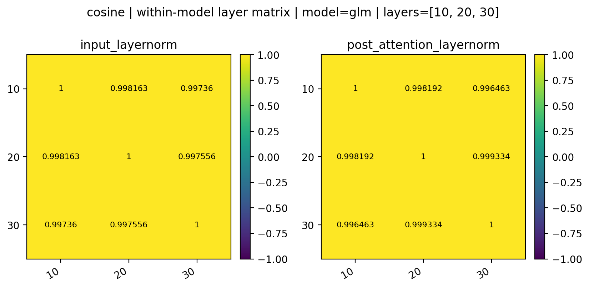

하지만 Mean Abs Diff로 비교할 경우, 서로 다른 레이어에서 추출한 Layernorm 파라미터 간의 차이가 존재함을 알 수 있습니다.

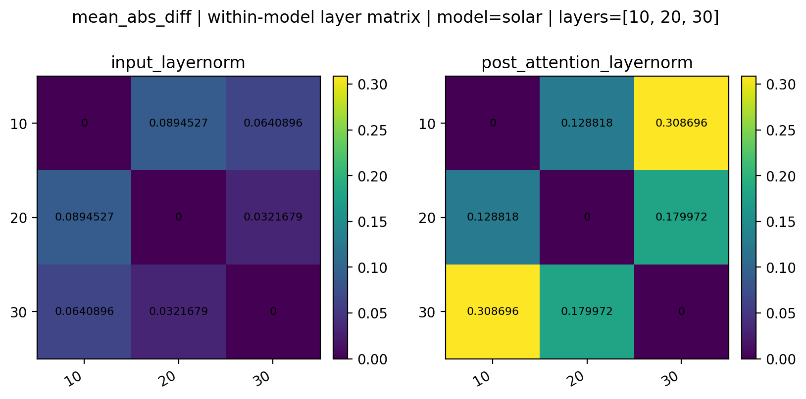

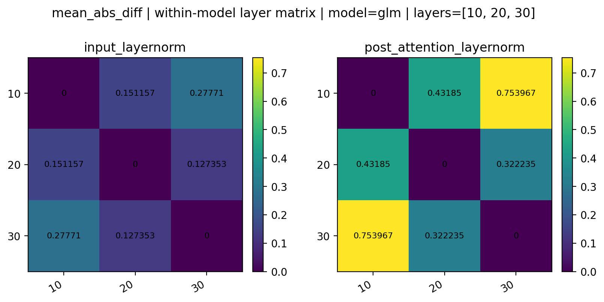

특히 `post_attention_layernorm`의 경우 더 멀리 떨어진 레이어일수록 Mean Abs Diff가 커지는 경향이 있지만 Cosine 유사도로는 이러한 경향을 포착할 수 없다는 점을 주목할 필요가 있습니다.

## 4. 왜 Cosine 유사도로는 모델간 유사성을 판단할 수 없는가?

**1. RMSNorm weight는 정보량이 작고 공통 Prior가 강합니다.**

RMSNorm은 보통 rank=1인 벡터 하나를 weight로 가집니다. 그래서 rank=2인 Attention, MLP의 weight와 달리 정보량이 매우 작습니다. 또한 RMSNorm weight는 대부분 1.0으로 초기화되며, 학습 후에도 값의 분산이 크지 않고(대체로 양수) 형태가 비슷하게 유지되는 경향이 있습니다. 이러한 특성 때문에 서로 다른 모델의 RMSNorm weight 간에도 높은 Cosine 유사도가 나타날 수 있습니다.

**2. Cosine 유사도는 방향성만을 고려합니다.**

Cosine 유사도는 벡터의 크기(스케일)를 무시하고 오직 방향성만을 고려합니다. 따라서 RMSNorm weight처럼 값의 형태가 균질한 파라미터에서는, 실제로는 스케일이나 다른 블록(Attention/MLP/MoE)의 차이가 존재하더라도 높은 Cosine 유사도가 쉽게 관측될 수 있습니다. 모델 간 유사성을 더 설득력 있게 판단하려면 Mean Abs Diff 같은 크기 기반의 지표를 함께 고려하는 것이 중요합니다.
